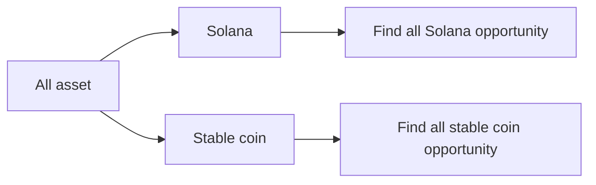

# Zen Portfolio

### Environment Variables / Local

```plaintext
# Local development
# LLM API Keys
OPENAI_KEY=

# helius
HELIUS_API_KEY=x
```

## Agent workflow



## Local Development

### Run with Peotry

To get started with this project, ensure you have Poetry installed. You can install it by following the instructions at [Poetry's official website](https://python-poetry.org/docs/#installation).

Once Poetry is installed, navigate to the project directory and run:

```bash
poetry install --no-root
```

This command will install all the dependencies specified in the `pyproject.toml` file.

To run the application, use the following command:

```bash
poetry run uvicorn app.main:app --reload
```

This will execute the script defined in the `pyproject.toml` file.

### Run with Docker

```bas
//TODO make this comand line work
docker-compose up -d
```

### Database Setup

1. Ensure PostgreSQL is running
2. Run database migrations:

Sync the latest DB
```bash
IS_LOCAL=true alembic upgrade head
```

Make migrations: (Please not use --autogenerate, it will cause error)
```bash
poetry run alembic revision -m "Initial migration"
```
